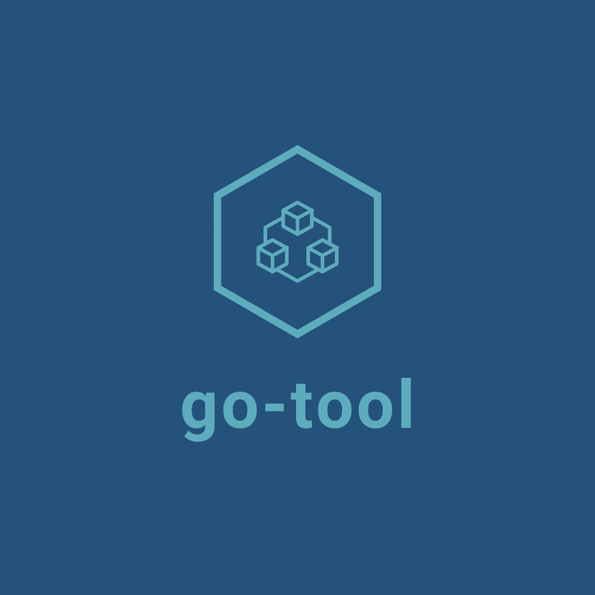

# Go Tool
<div align=center>


<br/>


[](https://github.com/hailong-bot/go-tool/releases)
[](https://pkg.go.dev/github.com/hailong-bot/go-tool/v2)
[](https://goreportcard.com/report/github.com/hailong-bot/go-tool/v2)
[](https://github.com/hailong-bot/go-tool/blob/main/LICENSE)

</div>

<div STYLE="page-break-after: always;"></div>

<p style="font-size: 20px"> 
    Go-tool is a comprehensive, efficient, and reusable util function library of go. Inspired by the java apache common package and lodash.js.    
</p>
<p style="font-size: 20px">
This tool is similar to the hutool toolkit in Java
</p>


## <a href="https://www.golancet.cn/en/" target="_blank"> Website</a> | [简体中文](./README_zh-CN.md)

## Features

-   👏 Comprehensive, efficient and reusable.
-   💪 In the future, other features will continue to be added, and now there are over 20 functions that support strings, slicing, and more
-   💅 Only depends on two kinds of libraries: go standard library and golang.org/x.
-   🌍 Unit test for every exported function.

## Installation
### Note:

1. <b>For users who use go1.18 and above, it is recommended to install  v2.x.x. Cause in v2.x.x all functions were rewritten with generics of go1.18.</b>
    ```go
    go get github.com/hailong-bot/go-tool/v2
    ```
2. <b>For users who use version below go1.18, you should install v1.x.x. The latest of v1.x.x is v1.4.3. </b>
    ```go
    go get github.com/hailong-bot/go-tool
    ```
## Usage

go-tool organizes the code into package structure, and you need to import the corresponding package name when use it. For example, if you use string-related functions,import the strutil package like below:
```go
import "github.com/hailong-bot/go-tool/strutil"
```

## Example

Here takes the string function Reverse (reverse order string) as an example, and the strutil package needs to be imported.

```go
package main

import (
    "fmt"
    "github.com/hailong-bot/go-tool/v2/strutil"
)

func main() {
    s := "hello"
    rs := strutil.Reverse(s)
    fmt.Println(rs) //olleh
}
```